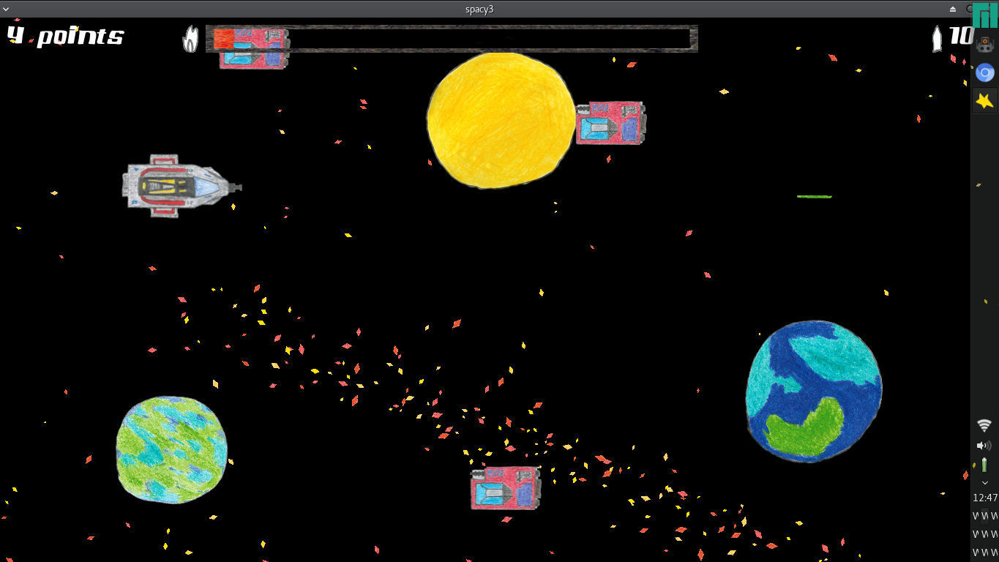

# spacy3
Spacy3 is my third attempt to write a small but playable game set in space. The previous games failed due to lack of interest or failing to limit the scope and complexity of the game.

# Screenshot

# How to play
Currently, [love2d](https://love2d.org/#download) must be installed to play the game.
The game itself can be [downloaded here](https://github.com/enra64/spacy3/releases)